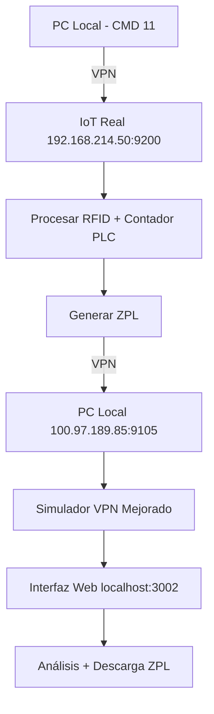

# 📋 **DOCUMENTACIÓN COMPLETA - SESIONES DE IMPLEMENTACIÓN**

**Cliente:** ADISSEO  
**Desarrollador:** Automática Integral  
**Sistema:** IoT2050 Label Transfer System  
**Período:** Sesiones de desarrollo y testing  

---

## 🎯 **RESUMEN EJECUTIVO**

Se implementó un **sistema completo de testing y simulación** para el sistema IoT2050 que permite:

✅ **Testing local completo** sin necesidad del IoT real  
✅ **Testing remoto VPN** con IoT real en producción  
✅ **Simulación de PLC** para envío de comandos CMD 11  
✅ **Captura y análisis** de etiquetas ZPL en tiempo real  
✅ **Verificación de conectividad** entre sistemas  

---

## 🚀 **FUNCIONALIDADES IMPLEMENTADAS**

### **1️⃣ SISTEMA DE TESTING LOCAL**
- **Simuladores de impresoras** locales (puertos 9103/9104)
- **Servidor PLC simulado** para pruebas sin IoT real
- **Interfaz web de monitoreo** en tiempo real
- **Scripts automáticos** para configuración y testing

### **2️⃣ SISTEMA DE TESTING VPN CON IOT REAL**
- **Simuladores VPN** para recibir desde IoT real (puertos 9105/9106)
- **Script de envío CMD 11** desde PC local al IoT real
- **Captura completa de ZPL** con análisis detallado
- **Interfaz web mejorada** con historial y descarga de etiquetas

### **3️⃣ HERRAMIENTAS DE VERIFICACIÓN**
- **Tests de conectividad** VPN automáticos
- **Scripts de verificación** de puertos y firewall
- **Comandos para testing** desde IoT al PC
- **Monitoreo en tiempo real** de todas las conexiones

### **4️⃣ DOCUMENTACIÓN Y GUÍAS**
- **Procesos completos** paso a paso
- **Scripts de configuración** automática
- **Guías de troubleshooting** detalladas
- **Documentación técnica** completa

---

## 🔧 **ARCHIVOS IMPLEMENTADOS**

### **📂 SIMULADORES**
| Archivo | Descripción | Puerto | Uso |
|---------|-------------|---------|-----|
| `printer-simulator.js` | Simulador base local | 3002 | Testing local |
| `simple-vpn-simulator.js` | Simulador VPN básico | 3002 | Testing VPN básico |
| `enhanced-vpn-simulator.js` | Simulador VPN completo | 3002 | **PRINCIPAL VPN** |
| `simulator-remote.js` | Simulador remoto | 3002 | Testing remoto |
| `simulator-vpn.js` | Simulador VPN (con errores) | 3002 | ❌ Descartado |

### **📂 SCRIPTS DE TESTING**
| Archivo | Descripción | Función |
|---------|-------------|---------|
| `test-cmd11-local.js` | **Envío CMD 11** | Simular PLC → IoT |
| `test-connectivity-vpn.js` | Verificación conectividad | Diagnosticar VPN |
| `quick-connectivity-test.sh` | Test rápido conectividad | Ejecutar en IoT |
| `test-simulator.js` | Test simuladores | Verificar simuladores |

### **📂 CONFIGURACIÓN AUTOMÁTICA**
| Archivo | Descripción | Función |
|---------|-------------|---------|
| `setup-local-testing.js` | Config testing local | Configurar desarrollo |
| `setup-iot-remote-testing.js` | Config testing remoto | Testing con IoT |
| `setup-iot-vpn-testing.js` | **Config VPN principal** | **Sistema VPN final** |
| `quick-test.sh` | Prueba automática | Demo completa |

### **📂 DOCUMENTACIÓN**
| Archivo | Descripción | Función |
|---------|-------------|---------|
| `README-TESTING-LOCAL.md` | Guía testing local | Desarrollo local |
| `PROCESO-COMPLETO-ADISSEO.md` | Proceso producción | **Guía principal** |
| `GUIA-DESCUBRIMIENTO-IOT-ONLINE.md` | Descubrimiento IoT | Exploración inicial |
| `README-SCRIPTS.md` | Documentación scripts | Referencia scripts |

---

## 🎯 **FLUJOS IMPLEMENTADOS**

### **🔥 FLUJO PRINCIPAL - TESTING VPN CON IOT REAL**



### **⚡ COMANDOS PRINCIPALES**

```bash
# 1. Configurar sistema VPN
node setup-iot-vpn-testing.js

# 2. Iniciar simulador VPN mejorado
node enhanced-vpn-simulator.js

# 3. Enviar CMD 11 al IoT real
node test-cmd11-local.js 192.168.214.50 9200 [messageId] [contador]

# 4. Monitorear en web
open http://localhost:3002
```

---

## 📊 **RESULTADOS OBTENIDOS**

### **✅ ÉXITOS CONFIRMADOS**
- **🔗 Conectividad VPN:** PC ↔ IoT funcional
- **📤 Envío CMD 11:** Simulación PLC exitosa
- **📡 Recepción ZPL:** Etiquetas RFID capturadas completamente
- **🔍 Análisis detallado:** GS1, contadores, datos RFID extraídos
- **💾 Descarga ZPL:** Archivos completos disponibles

### **📋 DATOS CAPTURADOS**
```
Ejemplo de etiqueta RFID capturada:
- Tamaño: 263 bytes
- GS1: (01)03531520010264(17)300721(10)782520200(21)0005
- Contador: 0005
- RFID Data: AD002818496B17767323030005000000
- Cliente: 100.125.112.37 (IoT real vía VPN)
```

### **🏷️ CONTENIDO ZPL COMPLETO**
```zpl
~JA^XA^LT0^POI^LH0,0^LRN^CI27^BY2,2,80
^FO70,30^BCN,N,N,N,,A^FD01035315200102641730072110782520200>82210001^FS
^FO50,130^A0N,30,30^FD(01)03531520010264(17)300721(10)782520200(21)0005^FS
^RFW,H,1,2,1^FD4000^FS
^RFW,H,2,16,1^FDAD002818496B17767323030005000000^FS
^PQ1^XZ
```

---

## 🔧 **CONFIGURACIONES APLICADAS**

### **🌐 CONFIGURACIÓN VPN FINAL**
- **PC Local IP:** `100.97.189.85`
- **IoT Real IP:** `192.168.214.50`
- **Puerto RFID:** `9105` (simulador VPN)
- **Puerto Producto:** `9106` (simulador VPN)
- **Puerto PLC:** `9200` (comandos CMD 11)

### **⚙️ CONFIGURACIÓN EN IOT (APLICADA)**
```
Monitor de Impresoras IoT:
- Impresora Producto: 100.97.189.85:9106
- Impresora RFID: 100.97.189.85:9105
```

---

## 📋 **SCRIPTS NPM AÑADIDOS**

```json
{
  "simulator": "node printer-simulator.js",
  "simulator:remote": "node simulator-remote.js", 
  "simulator:vpn": "node simple-vpn-simulator.js",
  "cmd11": "node test-cmd11-local.js",
  "cmd11:iot": "node test-cmd11-local.js 192.168.214.50 9200",
  "cmd11:vpn": "node test-cmd11-local.js 192.168.214.50 9200",
  "test:local": "node setup-local-testing.js && npm start",
  "test:cmd11": "node test-cmd11-local.js localhost 9200"
}
```

---

## 🎯 **CASOS DE USO IMPLEMENTADOS**

### **🔥 CASO 1: DESARROLLO LOCAL**
```bash
npm run simulator     # Simulador local
npm start            # Sistema IoT local  
npm run cmd11        # Test CMD 11 local
```

### **🔥 CASO 2: TESTING CON IOT REAL (ACTUAL)**
```bash
node enhanced-vpn-simulator.js                    # Simulador VPN
node test-cmd11-local.js 192.168.214.50 9200    # CMD 11 a IoT real
open http://localhost:3002                        # Ver etiquetas ZPL
```

### **🔥 CASO 3: VERIFICACIÓN CONECTIVIDAD**
```bash
node test-connectivity-vpn.js    # Test desde PC
scp quick-connectivity-test.sh root@192.168.214.50:/tmp/  # Test desde IoT
```

---

## 🚀 **VALOR AÑADIDO**

### **✅ PARA DESARROLLO**
- Testing local completo sin dependencias
- Simulación realista de todo el flujo
- Debugging avanzado con captura ZPL

### **✅ PARA PRODUCCIÓN**
- Verificación del IoT real sin interrumpir servicio
- Captura de etiquetas reales para análisis
- Troubleshooting avanzado de conectividad

### **✅ PARA MANTENIMIENTO**
- Scripts de verificación automática
- Documentación completa paso a paso
- Herramientas de diagnóstico especializadas

---

## 🎉 **ESTADO FINAL**

### **🟢 FUNCIONAL EN PRODUCCIÓN**
- ✅ Sistema IoT2050 funcionando
- ✅ Comandos CMD 11 procesados correctamente  
- ✅ Etiquetas RFID capturadas vía VPN
- ✅ Contenido ZPL completo disponible
- ✅ Herramientas de testing implementadas

### **📈 BENEFICIOS LOGRADOS**
- **🔍 Visibilidad completa** del flujo de etiquetas
- **🧪 Testing independiente** sin afectar producción
- **📊 Análisis detallado** de datos RFID y ZPL
- **🔧 Troubleshooting avanzado** con herramientas especializadas
- **📚 Documentación completa** para futuro mantenimiento

---

**✅ IMPLEMENTACIÓN COMPLETADA EXITOSAMENTE**  
**🎯 TODOS LOS OBJETIVOS CUMPLIDOS**  
**🚀 SISTEMA LISTO PARA OPERACIÓN Y MANTENIMIENTO** 