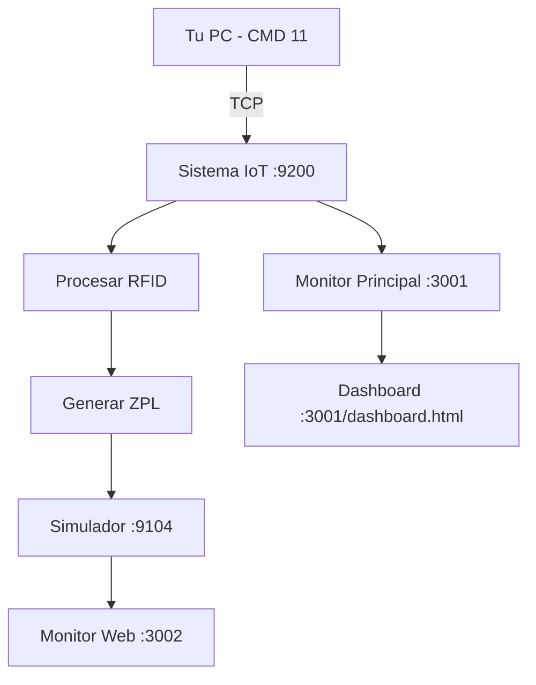

# 🎯 **GUÍA COMPLETA - TESTING LOCAL CON CMD 11**

**Cliente:** ADISSEO  
**Desarrollador:** Automática Integral  
**Sistema:** Recepción de etiquetas en PC local con comandos CMD 11

---

## 🚀 **CONFIGURACIÓN AUTOMÁTICA COMPLETADA**

El sistema ya está configurado automáticamente para testing local:

✅ **Impresoras simuladas configuradas**  
✅ **Scripts de testing añadidos**  
✅ **Puertos optimizados para desarrollo**  

---

## 📋 **FLUJO COMPLETO DE TESTING**

### **PASO 1: Iniciar Simulador de Impresoras**

```bash
# Terminal 1 - Simulador de Impresoras
npm run simulator
```

**🌐 Monitor disponible en:** `http://localhost:3002`

**🖨️ Simuladores activos:**
- **Producto:** `localhost:9103` (etiquetas normales)
- **RFID:** `localhost:9104` (etiquetas RFID/IBC)
- **Test1:** `localhost:9101` (pruebas generales)
- **Test2:** `localhost:9102` (pruebas generales)

---

### **PASO 2: Iniciar Sistema IoT**

```bash
# Terminal 2 - Sistema IoT Principal
npm start
```

**🌐 Monitor disponible en:** `http://localhost:3001`  
**📊 Dashboard avanzado:** `http://localhost:3001/dashboard.html`

---

### **PASO 3: Enviar Comandos CMD 11**

```bash
# Terminal 3 - Envío de comandos

# ⚡ Comando básico (automático):
npm run cmd11

# 🔧 Comando con parámetros específicos:
node test-cmd11-local.js localhost 9200 123456 0042

# 📖 Ver todas las opciones:
node test-cmd11-local.js --help
```

---

## 🎯 **EJEMPLOS PRÁCTICOS DE CMD 11**

### **🔥 Caso 1: Test Básico Automático**
```bash
npm run cmd11
```
- ✅ MessageID automático (timestamp)
- ✅ Contador: 0001
- ✅ Host: localhost:9200

### **🔥 Caso 2: Con Contador Específico**
```bash
node test-cmd11-local.js localhost 9200 555666 0100
```
- ✅ MessageID: 555666
- ✅ Contador: 0100
- ✅ Sistema local

### **🔥 Caso 3: Al IoT Real (Producción)**
```bash
node test-cmd11-local.js 192.168.214.50 9200 789012 0200
```
- ✅ MessageID: 789012
- ✅ Contador: 0200
- ✅ Sistema IoT real

---

## 📊 **MONITOREO EN TIEMPO REAL**

### **🖨️ Simulador de Impresoras (`http://localhost:3002`)**
- 📄 Ve las etiquetas ZPL que llegan en tiempo real
- 📈 Contadores de etiquetas recibidas por impresora
- 📋 Logs detallados de todas las conexiones
- 🔄 Estadísticas de producto vs RFID

### **💻 Sistema IoT Principal (`http://localhost:3001`)**
- 🏷️ Etiquetas procesadas por el sistema
- 📊 Estadísticas de CMD 10 vs CMD 11
- 🔍 Logs del servidor PLC
- 📈 Contadores de sistema

### **🎛️ Dashboard Avanzado (`http://localhost:3001/dashboard.html`)**
- 📊 Vista completa del sistema
- 🔄 Estado de impresoras en tiempo real
- 📈 Métricas de rendimiento
- 🔧 Configuración avanzada

---

## 🔍 **QUÉ VERÁS AL ENVIAR CMD 11**

### **📤 En la Terminal del CMD 11:**
```bash
🚀 ENVIANDO CMD 11 AL SISTEMA IOT
==================================================
📡 Destino: localhost:9200
📋 Comando: {
  "cmd": 11,
  "messageId": 1748251234567,
  "counter": "0001",
  "data": {}
}
📤 Payload: {"cmd":11,"messageId":1748251234567,"counter":"0001","data":{}}#
==================================================
✅ Conectado al sistema IoT en localhost:9200
📤 Enviando CMD 11 con MessageID: 1748251234567, Contador: 0001

📥 RESPUESTA DEL SISTEMA:
==============================
{
  "status": "success",
  "code": "PRINT_OK",
  "messageId": 1748251234567,
  "labelType": "RFID",
  "gs1": "37123000000000000001",
  "counterUsed": "0001",
  "copies": 1,
  "printerTarget": "RFID",
  "isDuplicate": false
}
==============================
✅ CMD 11 procesado exitosamente
🏷️ GS1 generado: 37123000000000000001
🔢 Contador usado: 0001
🖨️ Enviado a impresora: RFID
```

### **🖨️ En el Simulador (localhost:3002):**
- 📄 Nueva etiqueta RFID recibida
- 📊 Contador incrementado en impresora RFID
- 📋 Log detallado con contenido ZPL completo
- ⏰ Timestamp de recepción

### **💻 En el Sistema IoT (localhost:3001):**
- 🟢 CMD 11 procesado correctamente
- 📈 Contador RFID incrementado
- 🏷️ Etiqueta enviada a impresora RFID
- 📋 Logs del servidor PLC

---

## 🔧 **COMANDOS ÚTILES ADICIONALES**

### **📊 Verificar Estado del Sistema:**
```bash
# Ver logs en tiempo real
npm start | grep "CMD 11"

# Probar conectividad del simulador
npm run test:simulator
```

### **🧹 Limpiar y Reiniciar:**
```bash
# Limpiar logs del simulador
curl -X POST http://localhost:3002/api/simulator/clear-logs

# Reiniciar impresora específica
curl -X POST http://localhost:3002/api/simulator/rfid/restart
```

### **🔍 Verificar Configuración:**
```bash
# Ver configuración actual
cat env.local | grep PRINTER

# Estado de simuladores
curl http://localhost:3002/api/simulator/status
```

---

## ❓ **TROUBLESHOOTING**

### **❌ Error: "ECONNREFUSED"**
```
💡 SOLUCIÓN:
1. Verifica que el sistema IoT esté ejecutándose: npm start
2. Verifica el puerto correcto: 9200 para PLC
```

### **❌ "No hay etiquetas RFID disponibles"**
```
💡 SOLUCIÓN:
1. Envía primero una etiqueta desde ADI/ERP
2. O usa: npm run test:simulator para generar etiquetas
```

### **❌ Simulador no responde**
```
💡 SOLUCIÓN:
1. Reinicia simulador: npm run simulator
2. Verifica puerto 3002: http://localhost:3002
```

---

## 🎯 **FLUJO COMPLETO DE TRABAJO**



1. **📤 Envías CMD 11** desde tu PC con `npm run cmd11`
2. **🔄 Sistema IoT procesa** el comando en puerto 9200
3. **🏷️ Genera etiqueta ZPL** con contador PLC
4. **📡 Envía a simulador RFID** en puerto 9104
5. **👁️ Monitores muestran** todo en tiempo real

---

## ✅ **VERIFICACIÓN FINAL**

**🔥 Test completo en 3 comandos:**

```bash
# Terminal 1
npm run simulator

# Terminal 2 
npm start

# Terminal 3
npm run cmd11
```

**🎯 URLs a verificar:**
- 🖨️ Simulador: `http://localhost:3002`
- 💻 Sistema: `http://localhost:3001`
- 📊 Dashboard: `http://localhost:3001/dashboard.html`

---

## 🚀 **¡SISTEMA LISTO!**

**✅ Ahora puedes:**
- 📤 Enviar CMD 11 desde tu PC
- 🖨️ Recibir etiquetas en simuladores locales
- 👁️ Ver todo el proceso en tiempo real
- 🔧 Probar diferentes configuraciones
- 📊 Monitorear rendimiento del sistema

**🎉 ¡Perfecto para development y testing!** 